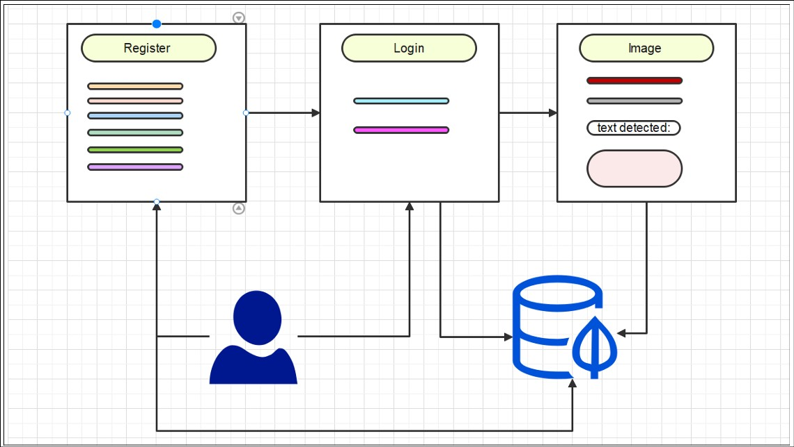
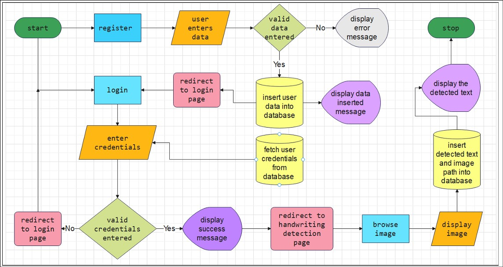
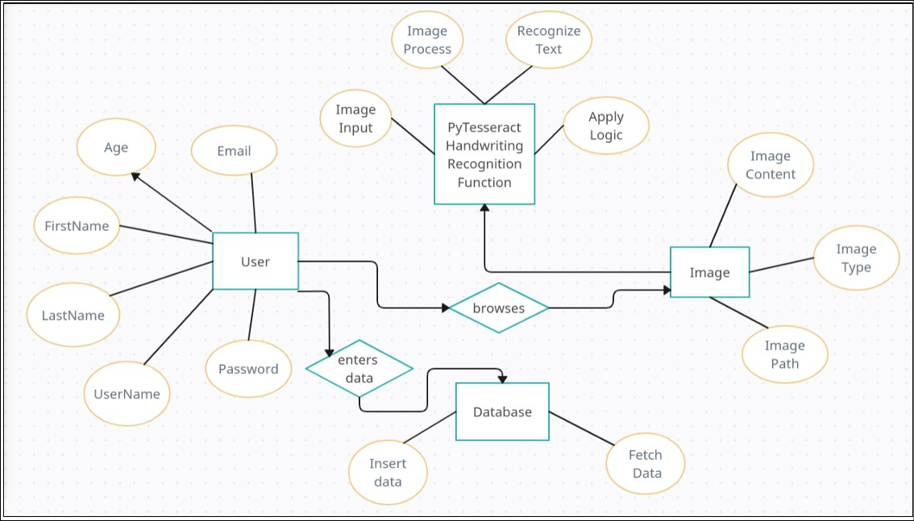
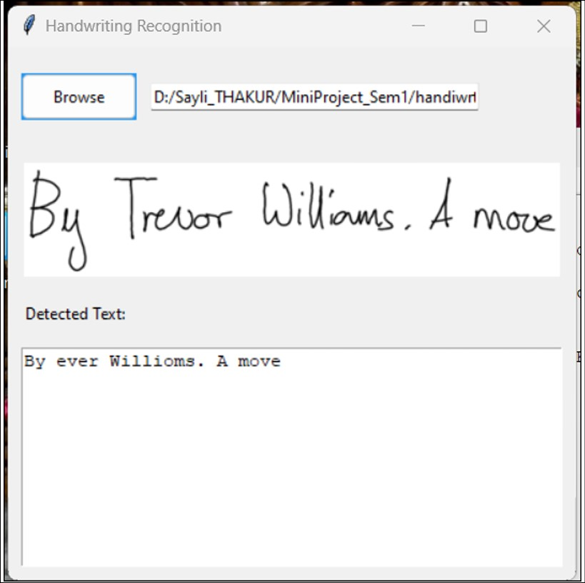
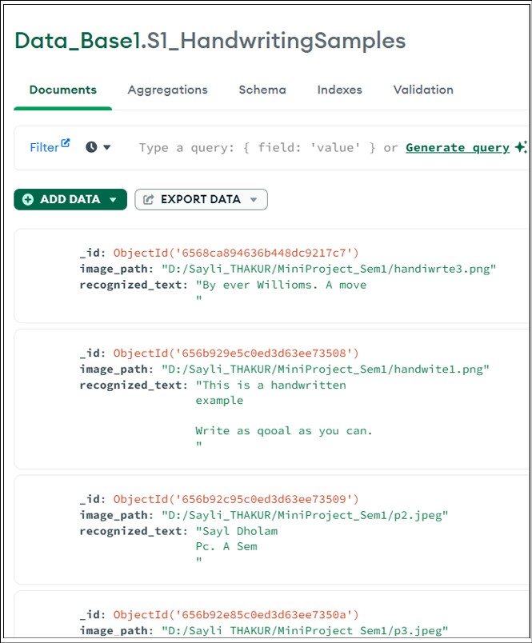

# Handwriting Recognition Application
The primary objective of this project is to allow the processing of data which 
comes from sources which are not in readily available state for analytical 
functions to work upon them.  
Here the concerned domain is the handwritten text base images from which text 
needs to be recognized, displayed and stored. </br>
This is where the application of OCR features, image processing, image storing, 
and alphabetical recognition become relevant.

</br>

## Technologies Used :
- CustomerTkinter : Python GUI library<br/>
- PyTesseract : OCR <br/>
- MongoDB : Database  <br/>

</br>

## Software Requirements :
1. Operating system: Windows 7 or higher <br/>
2. Front end: Python 3.11 <br/>
3. Back end: MongoDB x86_64_7.00   <br/>
4. Images samples in: .jpeg, .jpg, .png format    <br/>

</br>

### System Prerequisites :
Open cmd and execute the following command : </br>
```pip install pytesseract PIL pymongo customtkinter ```


<br/>
<br/>


<br/>*System Diagram*

<br/>


<br/>*Flowchart*

<br/>


<br/>*Entity Relationship Diagram*

<br/>


<br/>*Handwriting Recognition*

<br/>


<br/>*Database*

<br/>
